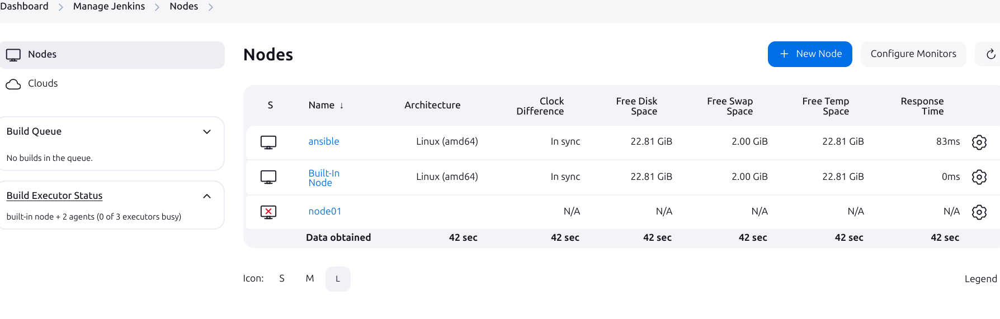
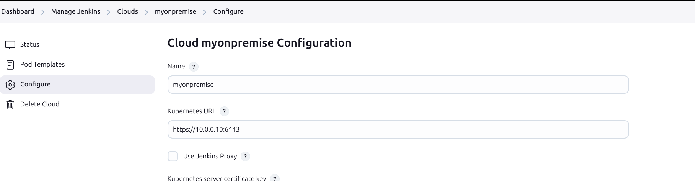

# devops/sre.technical-tests

This test is designed to evaluate your skills and experience in various aspects of the role for which you applied, including Virtualization, AWS Cloud management, Continuous Integration/Continuous Deployment (CI/CD), Infrastructure as Code (IaC), among others.

This test is designed to be completed in approximately 10–12 hours for the core tasks, assuming familiarity with the required tools and concepts. 
Bonus tasks may require an additional 6–8 hours if attempted. It is recommended to plan your time accordingly.

__You are encouraged to complete the core tasks first, as they are essential for demonstrating the foundational skills required for this position. Bonus tasks are optional and intended to showcase advanced expertise.__

Tasks

  - Core tasks are self-contained and can be completed independently.
  - Bonus tasks:
    - The CI/CD pipeline assumes that the containerization task has been completed.
    - The monitoring and performance optimization task builds on work done in the containerization and infrastructure as code sections.

We hope you find this test challenging and interesting. 

Good luck!

## (CORE) devops/sre.technical-tests.containerization

Containerize the provided application using Docker:
  - For the given application with a frontend (`Ariane`), a backend (`Falcon`) and a Redis (`redis`), create Dockerfiles for each component.
    - Ariane code repository: github.com/slgevens/example-ariane
    - Falcon code repository: github.com/slgevens/example-falcon
    - Redis must use port `6399`
  - Subsequently, write a Kubernetes deployment configuration to manage this multi-container application. 
    - It should include the following requirements:
        - Containers: Create Kubernetes Deployments for frontend, backend, and Redis. They should each have their own Deployment and be exposed with their own Service.
        - Networking: The frontend should communicate with the backend through a Service, and the backend should communicate with Redis in a similar manner.
        - ConfigMap/Secrets: Use a ConfigMap for any configuration that might vary between environments.
        - Persistence: Use a PersistentVolume and PersistentVolumeClaim to store data of Redis.

Deliverables:

- Dockerfiles for:
  - Ariane (frontend)
  - Falcon (backend)
  - Redis (customized to use port 6399)
- Kubernetes YAML manifests

## (CORE) devops/sre.technical-tests.infrastructure-as-code

Given an application with a frontend, a backend and a Redis, write Terraform scripts to provision a necessary infrastructure on AWS. These scripts should include the following resources:
  - 3 EC2 instances `technical-test-ariane`, `technical-test-falcon`, `technical-test-redis`
  - a VPC containing with following attached resources `technical-test-vpc`
    - a VPC Internet gateway `technical-test-internet-gateway`
    - a VPC NAT gateway `technical-test-nat-gateway`
    - 2 subnets (a `technical-test-public` and a `technical-test-private`)
    - an elastic ip address in the `technical-test-public` attached to the EC2 instance `technical-test`
    - a default VPC routing table `technical-test-routing-table`
      - the necessary route table entries to redirect the subnets
    - 3 security-groups
      - a security group `technical-test-ariane-security-group` with the following permission entries, attached to `technical-test-ariane`
        - Inbound/ protocol: HTTPS (TCP), port: 443, source: 82.11.22.33/32, descripton: Office
        - Inbound/ protocol: HTTPS (TCP), port: 443, source: 81.44.55.87/32, descripton: VPN
        - Inbound/ protocol: HTTPS (TCP), port: 443, source: 87.12.33.88/32, descripton: Home
        - Outboud/ protocol: All, port: All, source: 0.0.0.0/0, descripton: Internet outbound
      - a security group `technical-test-falcon-security-group` with the following permission entries, attached to `technical-test-falcon`
        - Inbound/ protocol: HTTP (TCP), port: 4000, source: `technical-test-ariane-security-group`, descripton: `technical-test-ariane-security-group`
        - Outboud/ protocol: All, port: All, source: 0.0.0.0/0, descripton: Internet outbound
      - a security group `technical-test-redis-security-group` with the following permission entries, attached to `technical-test-redis`
        - Inbound/ protocol: HTTP (TCP), port: 6399, source: `technical-test-falcon-security-group`, descripton: `technical-test-falcon-security-group`
        - Outboud/ protocol: All, port: All, source: 0.0.0.0/0, descripton: Internet outbound

Deliverables:

- Terraform scripts including all mentioned resources
- Terraform plan/output file showing resources to be created.
- README file explaining:
  - How to initialize and apply the Terraform configuration.
  - Resource hierarchy and purpose.

## (CORE) devops/sre.technical-tests.provisioning

Using the following yaml data structure and the provisioning tool of your choice (Ansible, Puppet, Salt, etc...), define the following tasks:

```yaml
---
user_accounts:
  jane.doe:
    name: Jane DOE
    mail: jane.doe@example.com
    position: Software Engineer
    office: London
    login: jane.doe
    passwd: Bv3h!p2DqP%Q
    groups: ["sudo", "developers"]
    ssh_keys:
      - "ssh-rsa AAAAB3NzaC1yc2EAAAABIwAAAQEA1C4os6Tq2z5Z3DywAfPO6r6kVWQ8mYeXYxz2XJHwIWmJ1FI/JD/Z7/F1RMIo+dFWuEJ3ODT/MwtSox+bcbD09Rf0Ex33PLO6dsWeRrT6CVXf7j/Gs2P8WQv/N1MdaLJfjKnDUH6pAxPpE7XqO4+FOuz3zHKRQyPgzDUp5IV4OgxtNHJXSmIkNg4bdfF+JDk9OTvrZHg3W37zCVhrg=="
  john.smith:
    name: John SMITH
    mail: john.smith@example.com
    position: Systems Administrator
    office: New York
    login: john.smith
    passwd: Zm9c&NvV7LbA
    groups: ["sudo", "it"]
    ssh_keys:
      - "ssh-rsa AAAAB3NzaC1yc2EAAAABIwAAAQEAqseVTHgNcmBbdfXZUoWJSxs9hcC3Ao4EzXKiJ6OFTS8EbJSrBzKJqU7TLsTnGzR8BOl6pOEx6PmMt6LQqqqX2lToB4Ml6qYzM69Z4F8W79fEJ5MpGfdKUXOnKIl1Tg4nOEBZldUxEAYddShlCSrnJddvBfNz93OqmPAK3Rq1xlSlyB6FdOIeoI4rGO8UHyXyIuFP6P1BPXwWfsXn8SJd7GoJIN8AmBXmR=="
  alice.williams:
    name: Alice WILLIAMS
    mail: alice.williams@example.com
    position: DevOps Engineer
    office: Berlin
    login: alice.williams
    passwd: Tq7d#3BpO1pN
    groups: ["sudo", "infra"]
    ssh_keys:
      - "ssh-rsa AAAAB3NzaC1yc2EAAAABIwAAAQEAqrsZ5FVNl3hj9ZkXVzO7dAOXfBqhJsOtqW32EHYcpEXYf4J7Opk6TQQyPs8zF4PKMtkhfL9TV3HE9QWFkNO8RcFtoR9P6g8P4FoG68UqcMJOEY2fcbUJtXEN3HZ5OtTkpj9fPBZRJ3f2ExfUwYkIO6g6jOQsVmABbOeZsPyF1IXf4JtBQuAql3QJSUnE8G6UxWoHIVLJ6FqTzVJrLoRqOc9=="
```

- Change the system open file limit to `65536` for the `root` user.
- Create all users accounts contained in the yaml data structure;
    - Users must be able to login with their `login` using their `ssh_keys`
    - Users must be part of the mentionned `groups`.
    - An `info` file in their `/home/USER/info` must contain the following informations : `name`, `position` & `office`.
- Install the `docker` package and then
    - Run a given container : `public.ecr.aws/q0x2y8f9/nginx-demo` – default exposed port is `55000`
    - Name the container `happy_roentgen`
- Download and copy the following [file – prrtprrt.txt](https://gist.githubusercontent.com/slgevens/aa9a2fc52cb5fef8b41c1b11a8b7d3e3/raw/dc1e3e288967bd4818277e4688d1daf615225337/prrtprrt.txt)
    - In each users `home/USER/prrtprrt.txt`
    - Locally (on your computer) in the working directory `$CURRENT_DIR/files/prrtprrt.txt`
- Encrypt sensitive data
    - Modify the yaml data structure above and encrypt each users `passwd`
    - __PROVIDE THE ENCRYPTION KEY in a dedicated variable, `encryption_key`__
- Use a role or a class install `nginx`
    - Expose the port `80` FORWARDING REQUESTS to the container `happy_roentgen`

Deliverables:

- main.yml playbook

## (BONUS - Optional) devops/sre.technical-tests.monitoring

Bonus task: advanced monitoring and performance optimization

- Monitoring
    - Set up a centralized monitoring solution for the multi-container application in Kubernetes.
        - Use Prometheus and Grafana to monitor the following metrics:
            - CPU and memory usage of the containers.
            - HTTP request rates, latencies, and error rates for the backend and frontend services.
            - Redis memory usage and hit/miss rates.
        - Create a Grafana dashboard with at least the following panels:
            - Overall cluster CPU and memory usage.
            - Per-service request latency and error rate.
            - Redis performance metrics.

- Performance optimization
    - Perform load testing on the backend service (Falcon) using the tool of your choice
        - Simulate a workload of 100 users for 5 minutes, with an increasing request rate.
        - Identify any bottlenecks in the application or infrastructure.
        - Propose at least two recommendations to improve the system’s performance, considering:
            - Horizontal or vertical scaling.
            - Database optimization for Redis.
            - Application tuning (e.g., caching, request batching).

- Alerting
    - Set up alerts in Prometheus for the following scenarios
        - CPU usage exceeds 80% for any container.
        - HTTP error rate exceeds 5% for the frontend or backend.
        - Redis memory usage exceeds 75%.
        - Integrate the alerts with a notification system of your choice (e.g., Slack, PagerDuty, or email).

Deliverables:

- Monitoring and alerting configuration files (Prometheus rules, Grafana dashboard JSON).
- Load test script and a short summary of the findings.
- Recommendations document outlining the observed bottlenecks and proposed improvements.

## (BONUS - Optional) devops/sre.technical-tests.ci-cd

Implement a CI/CD pipeline using the tool/sotfware of your choice (Jenkins, CircleCI, GitLab CI, etc.).

- The pipeline should include stages to deploy/configure frontend, backend, and Redis applications:
  - build 
    - this stage should build the repositories mentioned in the [## devops/sre.technical-tests.containerization](## devops/sre.technical-tests.containerization) section
  - test
    - this stage should use `mocha` (or any other framework) for the frontend, and `testing` (or any other framework) for the backend applications
  - deploy
    - this stage should update the deployments image version in a running Kubernetes cluster

Deliverables:

- Pipeline Configuration File for the chosen tool (e.g., .gitlab-ci.yml for GitLab CI, Jenkinsfile for Jenkins, etc.), containing described stages.
  I decide to use Jenkins for all teh three exercises.

  The were the jenkins nodes which I used:
  

   I also had connection to kubernetes master node from jenkins.

   

- README file explaining:
  - CI/CD pipeline workflow.


## General deliverables

- All scripts and configuration files submitted in a Git repository OR a zipped folder.

I used fot these exercise a Vagrantfile in which I deplo several virtual machines.
The template for the virtual machines can be foudn in Vagranfile togethe rwith all otehr files used for this prupose.
I ran the command `vagrant up` to provision all the necessary Virtualbox VMs on my local computer.


- Documentation (README files) for each section explaining:
    - Setup and usage instructions.
     
     I used command "vagrant up" to provision locally the following VirtualBox VMs

VBoxManage list vms | grep "vagrant-kubeadm" ##vagrant-kubeadm is teh folder where I provision all the virtualbox VMs

These were the virtualbox VMs provisioned

"vagrant-kubeadm-kubernetes_controlplane_1736601662917_85477" {9e3992a9-58e3-4c92-8b5c-c6e25acaf253}
"vagrant-kubeadm-kubernetes_node01_1736601969146_9224" {d74735cd-19b9-4c1d-8e62-b439618e734d}
"vagrant-kubeadm-kubernetes_node02_1736602273334_27143" {e6ae2ef1-2cf2-4975-9f9a-53691a5e745f}
"vagrant-kubeadm-kubernetes_jenkins_1736606514919_24460" {4d4feba7-72f1-468a-bbbb-f13846c1733c}
"vagrant-kubeadm-kubernetes_ansible_1736714405313_39276" {d9442b16-b144-4882-99d4-ab8a51819b23}

    Vagrantfile is teh file containing the setup for all the VMs used for these exercise.
    The folder caled "scripts "contains the initialization scripts for each VMs individually such as kubernetes controller, two kubernetes nodes, jenkins and ansible.
    I used jenkins to managed all kubernetes node including by folloiwng up the instructions from this youtube link https://www.youtube.com/watch?v=rc7jZrA2aKk
  
    The file settings.yaml contains all the settings for the virtualbox VMs.

    - Assumptions and decisions made during implementation.
       - I decided to use Jenkins for all the 3 exercises  by managing the kubernetes controller and kuberenetes nodes.
       - I test jenkins pieplien fo rthe first exercise 
       - I deployed terraform locally on my home omputer and I did not test Jenkinsfile for the second exercise to deploy EC2 VMs in my aws demo account.
         But, I have an idea on how to provison EC2 VMs in terraform by creating a pipeline through Jenkinsfiel which I worte for teh exercise number 2.
       - For the third exercise i use ansible VMs deployed by using virtubal box VM called ansible which I deployed by launching the command "vagrant up ansible" in teh fodler where i copied all these files.  
